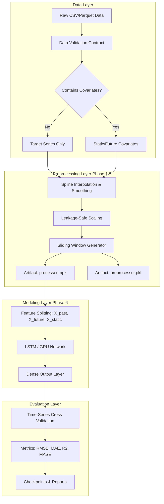

# Spline-LSTM Architecture & Technology Overview

## Motivation: Why Spline + LSTM?

Time-series forecasting in production environments poses significant challenges that single-model approaches struggle to solve. Raw data is rarely uniform; it contains missing values, irregular sampling intervals, sudden spikes, and multi-scale seasonality. 

**Long Short-Term Memory (LSTM)** networks are mathematically exceptional at capturing complex, long-range temporal dependencies due to their internal state and gating mechanisms (forget gate, input gate, output gate). However, LSTMs are notoriously sensitive to:
1. **Missing Data**: Gaps in the sequence break the temporal consistency LSTMs rely on.
2. **Noise Sensistivity**: High-frequency, erratic noise can trap gradient descent and lead to overfitting.
3. **Scale Variance**: Unscaled or drastically shifting ranges cause exploding gradients and instability during training.

**Spline Interpolation** provides the mathematical bridge. By applying piecewise polynomial functions (splines) directly to the raw time-series as a preprocessing step, we achieve several critical benefits:
- **Smooth Interpolation**: Splines "fill in the blanks" of missing data in a continuous, differentiable manner that preserves the underlying trend better than simple forward-filling or linear interpolation.
- **Denoising**: Controlled spline smoothing filters out high-frequency sensor noise while keeping macro-level structures (like daily or weekly seasonality) intact.
- **Temporal Alignment**: It standardizes the irregular data points into a steady, uniform grid that the LSTM expects.

**The Combination**: Splines turn chaotic real-world data into a clean, smooth, mathematical manifold. The LSTM then learns the temporal dynamics over this clean manifold, resulting in highly stable, resilient, and accurate forecasts.

---

## System Architecture

The project is structured as a robust pipeline bridging classical mathematical preprocessing and deep learning.

### 1. The Preprocessing Layer (Spline & Artifacts)
The `src/preprocessing/` module contains the ETL pipeline. It is intentionally decoupled from the deep learning model.
- **`pipeline.py` / `spline.py`**: Executes the spline fitting. It scales the data (e.g., Standard or MinMax) **only on the training split** to strictly prevent future-data leakage into the preprocessing step. 
- **`window.py`**: Converts the continuous arrays into sequence batches (`[samples, timesteps, features]`). It uniquely partitions known-future covariates (`X_future`) from past covariates (`X_past`).
- **Artifacts**: State is persisted into a JSON contract, a binary `.npz` file, and a pickle containing the scaler and spline coefficients (`preprocessor.pkl`).

### 2. The Modeling Layer (Multi-Input Recurrent Networks)
The `src/models/` module constructs the TensorFlow architectures.
Unlike standard univariate LSTMs, our Phase 6 architecture natively supports multiple disjoint input branches:
- **Branch A (`X_past`)**: Historical target values and historical covariates (processed via an LSTM layer).
- **Branch B (`X_future`)**: Future known events like holidays or promotional schedules (fed into persistent dense layers directly affecting the output gate).
- **Branch C (`X_static`)**: Non-time-varying entity features like Store Type or geographical group (embedded and concatenated at the final dense layers).

### 3. Time-Series Cross Validation (CV)
Traditional K-Fold CV fails on time-series data because it leaks future information. 
The system employs **Rolling-Window (Walk-Forward) Cross-Validation**:
- The model trains on a fixed historical window `[T0 : Ti]`.
- It validates on `[Ti+1 : Ti+H]`.
- The window steps forward, ensuring the model's true generalization is tested against chronologically unseen data.

---

## Technology Stack Justification

| Technology | Role | Justification |
|------------|------|---------------|
| **TensorFlow 2.x / Keras** | Core Deep Learning Backend | Chosen over PyTorch for production scale, serialization simplicity (`.keras` format), and seamless SavedModel exports to serving infrastructures like TF Serving. |
| **SciPy** | Spline Mathematics | `scipy.interpolate` provides battle-tested, highly optimized C-backend spline routines. |
| **NumPy & Pandas** | Data Manipulation | Vectorized transformations are required to perform the sliding window slicing efficiently before passing to TensorFlow. |
| **FastAPI** | Inference Backend | Asynchronous API layer for querying the model, supporting high-throughput validation and execution. Future-proofs integration with LLMs and external GUIs. |
| **Pytest** | Testing / Pipeline Verification | Deeply integrated to protect the mathematical contracts (e.g., ensuring zero data leakage in preprocessing). |

## Summary
The **Spline + LSTM** approach acts as a two-stage filter: SciPy Splines remove the physiological noise of real-world timing variations, while the TensorFlow LSTM learns the macro-behavioral patterns. The resulting pipeline is robust, reproducible, and ready for production inference operations.
